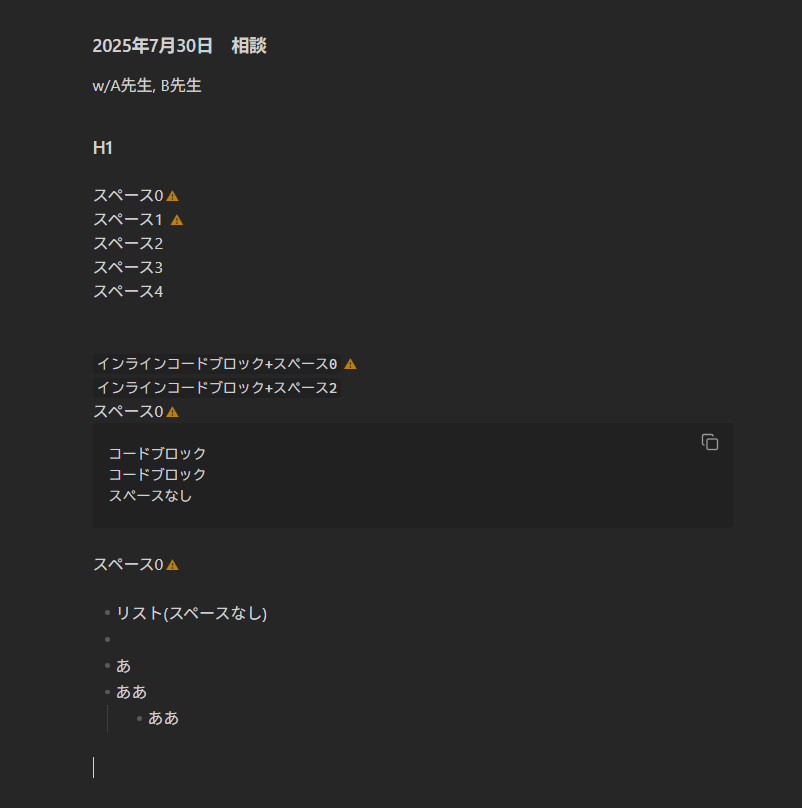

# Soft Line Break Highlighter

A plugin for Obsidian that highlights non-markdown line breaks in live preview mode.

## Overview

In Markdown, there are two types of line breaks:

- **Hard line breaks**: Created by adding two spaces at the end of a line followed by a newline
- **Soft line breaks**: Regular newlines without the two trailing spaces

This plugin helps you visualize where you have soft line breaks that might not render as expected in Markdown. It displays a warning icon (⚠) at the end of lines that don't end with two spaces but have a line break.

[Japanese Readme file](README.md)



## Features

- **Visual indicators**: Shows a warning icon (⚠) for non-markdown line breaks
- **Smart exclusions**: Automatically excludes certain Markdown elements where soft line breaks are acceptable:
  - Headers (H1-H6)
  - List items (bulleted and numbered)
  - Blockquotes
  - Code blocks
  - Horizontal rules
  - Table rows
  - Empty lines
- **Unobtrusive design**: Warning icons are subtle and don't interfere with your writing flow
- **Live preview only**: Only works in Obsidian's live preview mode

## Installation

### Manual Installation

1. Download the latest release from the [releases page](https://github.com/NobuoJt/soft-linebreak-highlighter/releases)
2. Extract the files to your Obsidian plugins folder: `<vault>/.obsidian/plugins/soft-linebreak-highlighter/`
3. Reload Obsidian or refresh plugins in Settings
4. Enable the plugin in Settings > Community plugins

### Development

1. Clone this repository
2. Run `npm install` to install dependencies
3. Run `npm run dev` to start development with hot reload
4. Run `npm run build` to build the production version

## Usage

Once installed and enabled, the plugin will automatically highlight soft line breaks in your documents. You'll see a small orange warning icon (⚠) at the end of lines that don't follow Markdown line break conventions.

### What gets highlighted

- Regular text lines that don't end with two spaces
- Paragraphs with soft line breaks

### What doesn't get highlighted

- Lines ending with two spaces (proper Markdown line breaks)
- Headers (`# ## ###` etc.)
- List items (`- * +` or `1. 2. 3.`)
- Blockquotes (`>`)
- Code blocks (` ``` `)
- Horizontal rules (`--- *** ___`)
- Table rows
- Empty lines

## Configuration

This plugin currently works out of the box with no configuration options. Future versions may include customization options for:

- Warning icon appearance
- Color schemes
- Additional exclusion rules

## Contributing

Contributions are welcome! Please feel free to submit issues or pull requests.

## License

This project is licensed under the MIT License.

## Changelog

### 0.1.1

- Initial release
- Basic soft line break detection
- Smart exclusions for common Markdown elements
- Visual warning indicators
